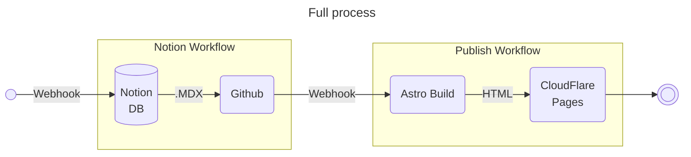
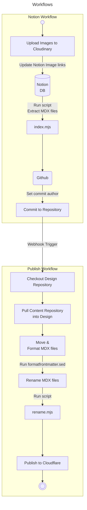

```mermaid
---
title: Full process
---
graph LR
    Start(( ))
    Start--Webhook-->Notion
    subgraph Notion Workflow
    Notion[(Notion\nDB)]
    GH(Github)
    Notion--.MDX-->GH
    end
    GH--Webhook-->Astro
    subgraph Publish Workflow
    Astro(Astro Build)
    CloudFlare(CloudFlare\nPages)
    Astro--HTML-->CloudFlare
    end
    End((( )))
    CloudFlare-->End
```

```mermaid
---
title: Workflows
---
graph TD
    subgraph Notion Workflow
    Actions(( ))
    NotionDB[(Notion\nDB)]
    UploadImages[Upload Images to Cloudinary]
    Actions-->UploadImages
    UploadImages--Update Notion Image links-->NotionDB--Run script\nExtract MDX files-->index.mjs
    Commit[Commit to Repository]
    Github(Github)
    index.mjs---->Github--Set commit author-->Commit
    end
    Commit--Webhook Trigger---->PD

    subgraph Publish Workflow
    PD[Checkout Design Repository]
    PC[Pull Content Repository\ninto Design]
    Format[Move &\nFormat MDX files]
    PD-->PC-->Format--Run formatfrontmatter.sed-->Process--Run script-->rename.mjs
    Process[Rename MDX files]
    Publish[Publish to Cloudflare]
    End((( )))
    rename.mjs---->Publish-->End
    end
```