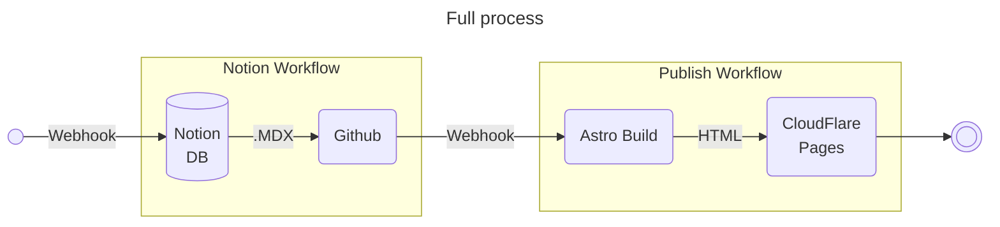
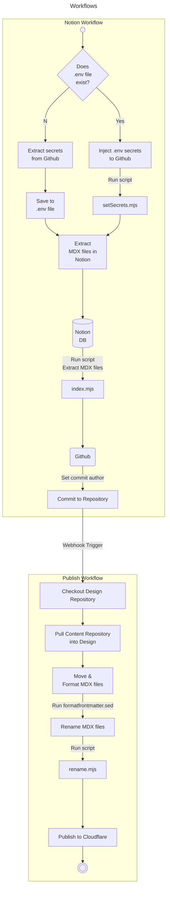

```mermaid
---
title: Full process
---
graph LR
    Start(( ))
    Start--Webhook-->Notion
    subgraph Notion Workflow
    Notion[(Notion\nDB)]
    GH(Github)
    Notion--.MDX-->GH
    end
    GH--Webhook-->Astro
    subgraph Publish Workflow
    Astro(Astro Build)
    CloudFlare(CloudFlare\nPages)
    Astro--HTML-->CloudFlare
    end
    End((( )))
    CloudFlare-->End
```

```mermaid
---
title: Workflows
---
graph TD
    subgraph Notion Workflow
    Local{Does\n.env file\nexist?}
    Actions(( ))
    Actions-->Local
    Extract[Extract secrets\nfrom Github]
    SaveToFile[Save to\n.env file]
    Inject[Inject .env secrets\nto Github]
    RunScript[setSecrets.mjs]
    Local--Yes-->Inject--Run script-->RunScript
    Local--No-->Extract-->SaveToFile
    NotionDB[(Notion\nDB)]
    ExtractFromNotion[Extract\nMDX files in\n Notion]
    SaveToFile-->ExtractFromNotion
    RunScript-->ExtractFromNotion
    ExtractFromNotion---->NotionDB--Run script\nExtract MDX files-->index.mjs
    Commit[Commit to Repository]
    Github(Github)
    index.mjs---->Github--Set commit author-->Commit
    end
    Commit--Webhook Trigger---->PD

    subgraph Publish Workflow
    PD[Checkout Design Repository]
    PC[Pull Content Repository\ninto Design]
    Format[Move &\nFormat MDX files]
    PD-->PC-->Format--Run formatfrontmatter.sed-->Process--Run script-->rename.mjs
    Process[Rename MDX files]
    Publish[Publish to Cloudflare]
    End((( )))
    rename.mjs---->Publish-->End
    end
```