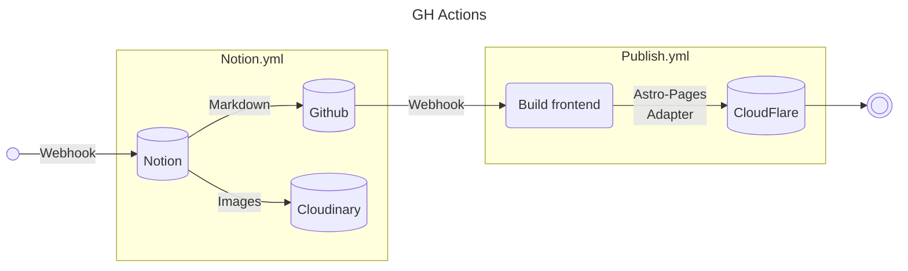

## Todo

- [ ] Rewrite/streamline publish.yml
- [ ] Include details/images to prepare ENV in README

## Rename .env.example to .env
```yaml
NOTION_TOKEN=               # <from notion>
NOTION_DATABASE_ID=         # <from notion, add database connections, read access>
CLOUDINARY_URL=             # <from cloudinary>
CLOUDINARY_UPLOAD_FOLDER=   # <create a cloudinary folder> e.g. site
CLOUDFLARE_API_TOKEN=       # <from cloudflare>
CLOUDFLARE_ACCOUNT_ID=      # <from cloudflare>
FOLDER_NAME=                # blog
DESIGN_REPO_NAME=           # astro-blog
PULL_ASTRO_REPO=            # <design repo token required if design repo is PRIVATE>
```

## Install and run
```
npm install
npm run dev
```

## File structure

```tree
.
├── .               # README.md, pkg.json, etc
├── blog            # FOLDER_NAME .env
│   └── post.mdx    # Markdown files
├── packages
│   └── savenotion
│       ├── queryDatabase.js
│       ├── queryPage.js
│       └── retrievePage.js
└── scripts
    ├── index.mjs
    ├── frontmatter.mjs
    ├── rename.mjs
    └── setSecrets.mjs
```

## Workflows



## Verbose

1. Create .env - Github repository secrets
1. Upload images from Notion - Cloudinary
1. Download .mdx - Notion
1. Parse YAML frontmatter on .mdx
1. Upload .mdx - Github
1. Trigger publish workflow
1. Checkout .mdx repository
1. Checkout Astro repository
1. Rename .mdx
1. Push to Cloudflare Pages
